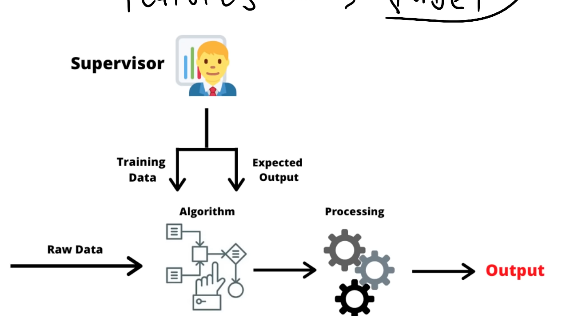
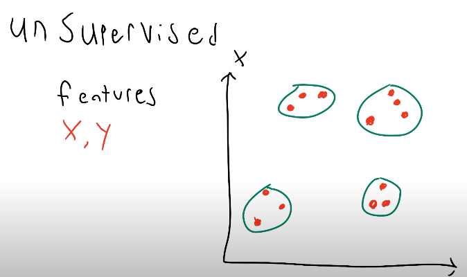
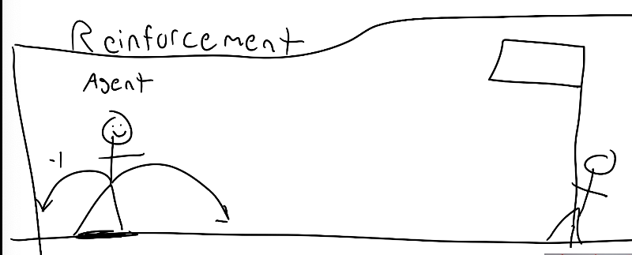

# notes
- feature: input data
- label: predict output

## Different Types of Machine Learning
- Supervised Learning
- Unsupervised Learning
- Reinforcement Learning

## supervised Learning
using features to train AI to get label, then cross-reference to the actual label to AI predicted label, then adjust the AI to produce more accurate label

## Unsupervised Learning
we only have features, don't have label. using unsupervised learning to try to group similar data into multiple groups

## Reinforcement Learning
don't have any data, only have `agent`, `environment` and `reward`. the agent inside env and when agent did correct move towards target, then positive reward been given, otherwise, negative rewards will be given. 
after training, the agent will know how to archive target.

